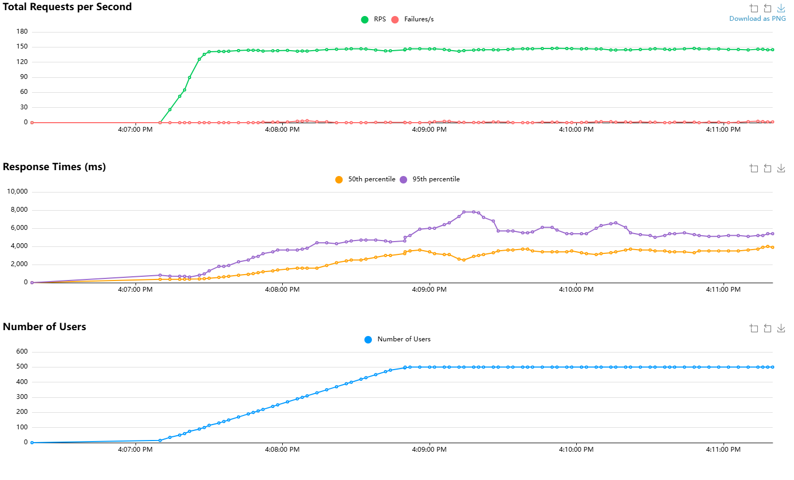
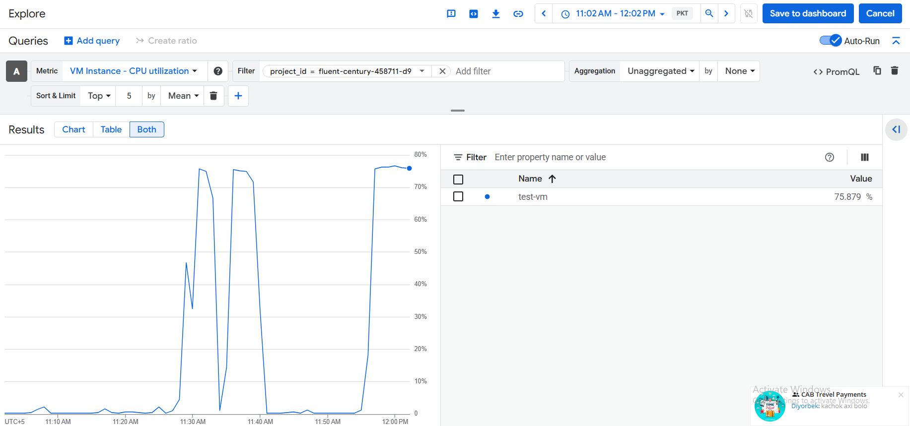

### 1. Django-REST-Framework da qilinga barcha API larim uzoq vaqtda ishlayapti:

`Misol uchun`:

1. **Loyihani yuqoridagi 2 ta serverda sinaganimda:**
   Menda ikkit server bor, har bir `server` `8vCPU(4 core) 16 GB RAM` ga ega. Bu serverlar turli joyda joylashgan.
   `Django-REST-Framwork` loyihamni birinchi serverda `run` qildim, `PostgreSQL` ni boshq serverda `run` bo'lganida
   - `http://35.194.106.39:8000/token/` - **x-latency: `1.691 seconds`**
   - `http://35.194.106.39:8000/users/` - **x-latency: `1.129 seconds`**
   - `http://35.194.106.39:8000/payment/` - **x-latency: `1.658 seconds`**

2. **Local kompyuterda vaqtlar:**
   `Django-REST-Framwork` loyihamni o'zimnin shaxsiy kimpyuterimda `run` qildim, `PostgreSQL` ni yuqoridagi xarakteristikaga ega serverda `run` bo'lganida 
   - `http://127.0.0.1:8000/token/` - **x-latency: `2.226 seconds`**
   - `http://127.0.0.1:8000/users/` - **x-latency: `1.993 seconds`**
   - `http://127.0.0.1:8000/payment/` - **x-latency: `2.930 seconds`**

3. **`Django-REST-Framwork` va `PostgreSQL` ni o'zimnin shaxsiy kimpyuterimda `run` qilganimdagi vaqtlar :**
  **Mening shaxsiy kompyuterim xarakteristikasi:** `AMD Ryzen 5 6600H with Radeon Graphics 3.30 GHz` `16.0 GB (15.2 GB usable)`
   - `http://127.0.0.1:8000/token/` - **x-latency: `0.459 seconds`**
   - `http://127.0.0.1:8000/users/` - **x-latency: `0.044 seconds`**
   - `http://127.0.0.1:8000/payment/` - **x-latency: `0.049 seconds`**
4. `Django-REST-Framework` loyihasini va `PostgreSQL` ni bita serverda local bog'lanish orqali run qilganimda.(`Server` harakteristikasi yuqoridagi serverlar bilan bir hil)
   - `http://35.194.106.39:8000/token/` - **x-latency: `0.524 seconds`**
   - `http://35.194.106.39:8000/users/` - **x-latency: `0.024 seconds`**
   - `http://35.194.106.39:8000/payment/` - **x-latency: `0.030 seconds`**
   -  **PostgreSql-config:**
       - max_connections = 100
       - shared_buffers = 128MB 
       - #effective_cache_size = 4 GB
       - #maintenance_work_mem = 64MB
       - #checkpoint_completion_target = 0.9 
       - #wal_buffers = -1 
       - #default_statistics_target = 100 
       - #random_page_cost = 4.0 
       - #effective_io_concurrency = 1 
       - #work_mem = 4MB   
       - #huge_pages = try  
       - max_wal_size = 1GB
       - min_wal_size = 80MB 
       - #max_worker_processes = 8
       - #max_logical_replication_workers = 4 
       - #max_parallel_workers_per_gather = 2 
       - #max_parallel_workers = 8
       - #max_parallel_maintenance_workers = 2
 
   - Locust:
     

Serverdagi yuklanma

**Mening kompyuterimning Konfiguratsiyasi uchun optimal `Latency`:**

| Scenario                       | Kutilgan Vaqt (Latency) |
|--------------------------------|-------------------------|
| Oddiy ish rejimi (DEBUG=True)  | 150-500 ms              |
| Produksion rejim (DEBUG=False) | 80-300 ms               |
| Optimallashtirilgan holat      | 50-200 ms               |

