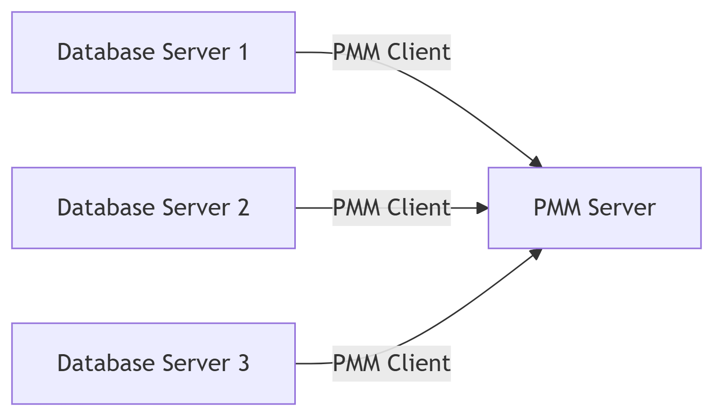

### 1. `Percona Monitoring and Management` (`PMM`) Server va `Client` tushunchalari:

**PMM Server** - Monitoring markazi

**PMM Server** - bu markaziy monitoring tizimi bo'lib, quyidagi vazifalarni bajaradi:
1. **Ma'lumotlarni yig'ish va saqlash:** Barcha monitoring qilinadigan serverlardan ma'lumotlarni qabul qiladi va saqlaydi
2. **Veb-interfeys:** Grafana asosida ishlaydigan dashboardlar orqali ma'lumotlarni vizual ko'rsatadi
3. **Xavfsizlik:** Foydalanuvchilarni autentifikatsiya qilish va ularga ruxsatlar berish
4. **Hisobotlar:** Performance bilan bog'liq hisobotlar tayyorlash

`PMM Server` odatda alohida serverda yoki containerda (`Docker`, `Kubernetes`) ishlaydi.

`PMM Client` - Monitoring agenti

`PMM Client` - bu monitoring qilinadigan har bir serverga o'rnatiladigan dastur bo'lib, quyidagilarni bajaradi:

1. **Metrikalarni yig'ish:** `CPU`, `RAM`, `disk`, tarmoq va boshqa tizim ko'rsatkichlari
2. **DB performance ma'lumotlari:** `MySQL`, `PostgreSQL`, `MongoDB` va boshqa ma'lumotlar bazalari statistikasi
3. **Query analytics:** `SQL` so'rovlarni monitoring qilish va tahlil qilish
4. **Ma'lumotlarni serverga yuborish:** Yig'ilgan ma'lumotlarni `PMM` Serverga uzatish

`PMM Server` va `Client` o'rtasidagi aloqa



1. Har bir monitoring qilinadigan serverda `PMM Client` ishlaydi
2. Clientlar ma'lumotlarni yig'ib, PMM Serverga yuboradi
3. `PMM Server` barcha ma'lumotlarni birlashtirib, foydalanuvchiga tahlil qilish uchun taqdim etadi

Qo'shimcha ma'lumot
`PMM` tizimi quyidagi komponentlardan foydalanadi:
- `Prometheus` - vaqt seriyali ma'lumotlar bazasi (metrikalar uchun)
- `Grafana` - vizualizatsiya vositasi
- `VictoriaMetrics` - `alternativ` ma'lumotlar bazasi (opsional)
- `Query Analytics` - `SQL` so'rovlarni tahlil qilish vositasi


### 2. `Percona Monitoring and Management` (`PMM`) Serverni Docker bilan O'rnatish (Docker Filesiz)

**`Docker` volumini yaratish:**

```bash
  sudo docker volume create pmm-data
```

**`PMM Server` konteynerini ishga tushirish:**

```bash
   sudo docker run -d \
     --name pmm-server \
     --restart always \
     -p 80:80 \
     -p 443:443 \
     -v pmm-data:/srv \
     -e ENABLE_DBAAS=1 \
     percona/pmm-server:2
```

**PMM Serverga Kirish**

- `Google Cloud Console`-da `VM instance` uchun tashqi `IP` manzilini aniqlang
- Veb-brauzerda quyidagi manzilga kiring:
    ```ini
    http://<sizning-server-ip-manzilingiz>
    ```
- **Dastlabki kirish ma'lumotlari:**
  - `Login`: admin
  - `Parol`: admin (birinchi marta kirgandan so'ng o'zgartiring)

**Qo'shimcha Sozlamalar**

```bash
sudo docker exec -it pmm-server bash -c 'curl -s https://raw.githubusercontent.com/percona/pmm/main/gethttps.sh | bash'
```
**`PMM` ni yangilash:**
```bash
   sudo docker stop pmm-server
   sudo docker rm pmm-server
   sudo docker pull percona/pmm-server:2
   sudo docker run -d --name pmm-server --restart always -p 80:80 -p 443:443 -v pmm-data:/srv -e ENABLE_DBAAS=1 percona/pmm-server:2
```

**Monitoring qilinadigan serverga `PMM Client` o'rnatish**
Monitoring qilmoqchi bo'lgan har bir serverda:
```bash
   curl -fsSL https://repo.percona.com/apt/percona-release_latest.generic_all.deb -o /tmp/percona-release.deb
   sudo apt-get install -y /tmp/percona-release.deb
   sudo apt-get update
   sudo apt-get install -y pmm2-client
   sudo pmm-admin config --server-url=http://<pmm-server-ip>:80 --server-insecure-tls
   sudo pmm-admin add mysql --username=pmm --password=pass --query-source=slowlog
```
**Muhim Eslatmalar**
- Agar 80-port band bo'lsa, boshqa portga yo'naltirishingiz mumkin:
    ```bash
      sudo docker run -d -p 8080:80 ... # va hokazo
    ```
- `PMM` ma'lumotlarini saqlash uchun Docker volumini muntazam backup qiling
- Ishlab turgan `PMM` konteynerini tekshirish:
    ```bash
    sudo docker ps
    sudo docker logs pmm-server
    ```
> Ushbu usul `Docker` faylsiz, to'g'ridan-to'g'ri `Docker` buyruqlari yordamida `PMM` serverni o'rnatish imkonini beradi. Bu oddiyroq yondashuv bo'lib, tez o'rnatish uchun qulay.

### 3. `PMM` Client (Monitoring Agenti) o'rnatish

`PMM Client` - bu Percona Monitoring and Management tizimida monitoring qilinadigan har bir serverga o'rnatiladigan agent. Quyidagi qadamlar bilan uni o'rnatishingiz mumkin:

1. **Dastlabki talablar**
   - `Root` yoki `sudo` huquqlariga ega foydalanuvchi
   - `PMM Server` ishlayotgan va ulanish mumkin bo'lgan
   - Minimal tizim talablari: `1 CPU`, `1GB` `RAM`, `10GB` disk

2. **O'rnatish jarayoni**
   - a) **`Paket` manbalarini qo'shish (Debian/Ubuntu)**
       ```bash
        curl -fsSL https://www.percona.com/get/pmm | /bin/bash  
       ```
   - b) **`PMM` Serverga ulanish**

     ```bash
       sudo pmm-admin config --server-insecure-tls --server-url=https://admin:admin@<PMM_SERVER_IP>
     ```
     Bu yerda:
     - `<PMM_SERVER_IP>` - `PMM Server IP` manzili
     - `admin:admin` - standart login:parol (agar o'zgartirilgan bo'lsa, yangisini yozing)
   - c) **Monitoring qilinadigan servislarni qo'shish**
     - `PostgreSQL` uchun:
        ```bash
        sudo pmm-admin add postgresql --username=pmm --password=<password>
        ```
     - `MongoDB` uchun:
        ```bash
        sudo pmm-admin add mongodb --username=pmm --password=<password>
        ```
     - `MySQL/MariaDB` uchun:
        ```bash
        sudo pmm-admin add mysql --username=pmm --password=<password> --query-source=slowlog
        ```
3. **Sozlamalarni tekshirish**
  - a) **Qo'shilgan servislarni ko'rish**
     ```bash
     sudo pmm-admin list
     ```
  - b) **Agent holatini tekshirish**
     ```bash
     sudo pmm-admin status
     ```
4. **Agentni yangilash**

  ```bash
     sudo apt-get update
     sudo apt-get upgrade pmm2-client
  ```
5. **Agentni o'chirish**

  ```bash
     sudo apt-get remove pmm2-client
  ```
> O'rnatish muvaffaqiyatli bo'lsa, `PMM Server` veb-interfeysida yangi qo'shilgan `server` va uning ma'lumotlarini ko'rishingiz mumkin bo'ladi.


### 4. `Error`:Connection check failed: pq: password authentication failed for user "myuser".

**`PostgreSQL Monitoring` Agentini qo'shishda xatolik yechimi**

Sizga `password` `authentication` `failed` xatosi berilayotgani, `PMM` agenti `PostgreSQL` serverga berilgan hisob ma'lumotlari bilan ulanayotgani, ammo muvaffaqiyatsiz tugayotganini ko'rsatadi.

**Xatolik sabablari:**

1. **Noto'g'ri foydalanuvchi nomi yoki parol:** `username` foydalanuvchisi mavjud emas yoki parol noto'g'ri
2. **Maxsus belgilar muammosi:** Paroldagi `@`, `#`, `$` belgilari tufayli
3. **`PG_HBA.conf` sozlamalari:** `PostgreSQL` ulanishga ruxsat bermayapti
4. **Foydalanuvchida monitoring uchun yetarli huquqlar yo'q**

**Yechimlar:**

1. **Parol muammosini hal qilish (eng keng tarqalgan sabab)**
  ```bash
      # Parolni qo'shtirnoq ichiga oling
      sudo pmm-admin add postgresql --username=myuser --password='Test@#$8450'
      
      # Yoki URL encode qiling
      sudo pmm-admin add postgresql --username=myuser --password=Test%40%23%248450
  ```
2. `PostgreSQL` da foydalanuvchini tekshirish va huquqlarni berish

**`PostgreSQL` serveriga ulaning va quyidagilarni bajaring:**

  ```sql
  -- Foydalanuvchi mavjudligini tekshirish
  SELECT usename FROM pg_user WHERE usename = 'myuser';
  
  -- Agar yo'q bo'lsa, yaratish
  CREATE USER myuser WITH PASSWORD 'Test@#$8450';
  
  -- Monitoring uchun kerakli huquqlarni berish
  ALTER USER myuser WITH SUPERUSER;
  -- Yoki
  GRANT pg_monitor TO myuser;
  ```
3. **`pg_hba.conf` faylini sozlash**
   - `pg_hba.conf` faylini toping (odatda `/etc/postgresql/[version]/main/pg_hba.conf`)
   - Quyidagi satrni qo'shing yoki yangilang:
     ```ini
     host    all             myuser             0.0.0.0/0               md5
     host    all             myuser             ::/0                    md5
     ```
4. **`Alternative` komanda yozish**
  ```bash
     sudo pmm-admin add postgresql \
       --username=myuser \
       --password='Test@#$8450' \
       --host=localhost \
       --port=5432 \
       --service-name=custom_pg_service
  ```
5. **Test ulanishni tekshirish**

Agentni qo'shishdan oldin, ulanishni mustaqil ravishda tekshiring:

```bash 
   psql -U myuser -h localhost -W
```
> Agar bu komanda ham xato bersa, muammo `PMM` bilan emas, balki `PostgreSQL` sozlamalari bilan bog'liq.


**Qo'shimcha choralar:**
1. `PostgreSQL` server ishlayotganligini tekshirish:
  ```bash
    sudo systemctl status postgresql
  ```
2. Firewall sozlamalarini tekshirish:
  ```bash
    sudo ufw allow 5432/tcp
  ```

3. `PMM agent` loglarini tekshirish:
  ```bash
    journalctl -u pmm-agent -f
  ```
> Agar barcha usullar ishlamasa, paroldan maxsus belgilarni olib tashlab, yangi parol bilan qayta urinib ko'ring.


